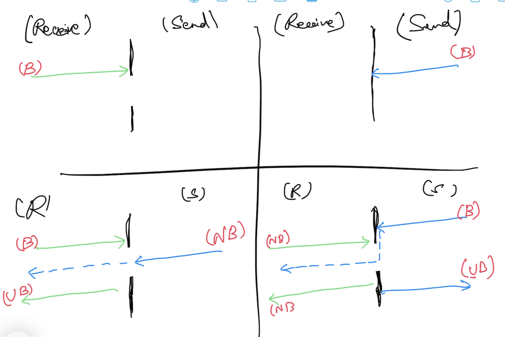

# Advanced Go

## Magesh Kuppan
- tkmagesh77@gmail.com

## Schedule
- Commence      : 9:00 AM
- Tea Break     : 10:30 AM (20 mins)
- Lunch Break   : 12:30 PM (1 hr)
- Tea Break     : 3:00 PM (20 mins)
- Wind up       : 5:00 PM

## Methodology
- No powerpoint
- Code & Discussion
- No dedicated time for Q&A

## Repository
- https://github.com/tkmagesh/cisco-advgo-may-2024

## Software Requirements
- Go Tools
- Visual Studio Code 
- Go extension for VS Code

## Prerequisites
- Familiar with the following Go concepts
    - Data Types
    - Programming Constructs
    - Pointers
    - Error Handling
    - Functions
    - Functional Programming
        - Higher Order Functions
        - Anonymous Functions
        - Deferred Functions
    - Panic & Recovery
    - Structs & Struct Composition
    - Interfaces

## Agenda
    - Recap
    - Concurrency
    - Concurrency Patterns
    - HTTP Services
    - GRCP
    - Testing
    - Performance Enginneering
        - Microbenchmarking
        - Profiling

## Recap
### Higher Order Functions
- functions like data
    - Assign a function to a variable
    - Pass a function as an argument to another function
    - Return a function as a return value
### Deferred Functions
- Postpone the execution of a function until the current function execution completes
### Struct Composition
- Composition is how go implements "inheritance"

## Concurrency
- A design methodology where the application has more than one execution path
- Typically achieved using OS theads (1 OS Thread = 2 MB)

## Concurrency in Go
- Builtin Scheduler
- Concurrent operations are represented in light-weight threads call goroutines
- Goroutines are cheap (4 KB)
- Scheduler maps goroutines to OS Threads
- Language support for concurrency
    - go keyword, channel (chan) data type, channel ( <- ) operator, for range construct, select case construct
- API support
    - sync package
    - sync/atomic package

### Channels
- data type for enabling communication between goroutines
#### Declaration
```go
var ch chan int
```
#### Initilialization
```go
ch = make(chan int)
```
#### Combine Declaration & Initialization
```go
ch := make(chan int)
```
#### Channel Operations 
- Using the channel operator ( <- )
##### Send Operation
```go
ch <- 100
```
##### Receive Operation
```go
data := <- ch
```
#### Channel Behavior
**The first operation (send or receive) on a channel will ALWAYS be a blocking operation**



## Context
- Cancel Propagation across hierarchy of goroutines
- Cancellation can be
    - programmatic
    - time based
- Contexts can be created as a hierarchy
- Root context is created with 'context.Background()'
- Context factory methods:
    - context.WithTimeout()
    - context.WithDeadline()
    - context.WithCancel()
- Can also use contexts to share data across goroutines
    - context.WithValue()
    
## Curl
```go
curl http://localhost:8080/products

curl http://localhost:8080/products -X POST -H 'Content-Type:application/json' -d '{"name":"Scribble Pad","cost":20,"category":"Stationary"}'
```

## GRPC
- Alternative to HTTP based restful services
- Optimal for micro-services communication
- Communication Patterns
    - Request & Response
    - Server Streaming (one request & stream of responses)
    - Client Streaming (stream of requests & one response)
    - Bidirectional Streaming (stream of requests & stream of responses)
- HTTP2
- Uses Protocol Buffers for serializing payloads
    - Share the schema among the consumers and producers in advance
- Multi-language supports
    - Go
    - Java
    - .NET
    - Node.js
    - Python
### Steps: 
    - Create "service / operations / data" contracts using protocol buffers
    - Share the contract between the client & server
    - Generate proxy & stub using the contracts
    - Server
        - implement the service (with the business logic) based on the contract
        - host the service
    - Client
        - Use the proxy to communicate to the service


### Tools Installation 
    1. Protocol Buffers Compiler (protoc tool)
        Windows:
            Download the file, extract and keep in a folder (PATH) accessble through the command line
            https://github.com/protocolbuffers/protobuf/releases/download/v24.4/protoc-24.4-win64.zip
        Mac:
            brew install protobuf

        Verification:
            protoc --version

    2. Go plugins (installed in the GOPATH/bin folder)
        go install google.golang.org/protobuf/cmd/protoc-gen-go@v1.28
        go install google.golang.org/grpc/cmd/protoc-gen-go-grpc@v1.2
